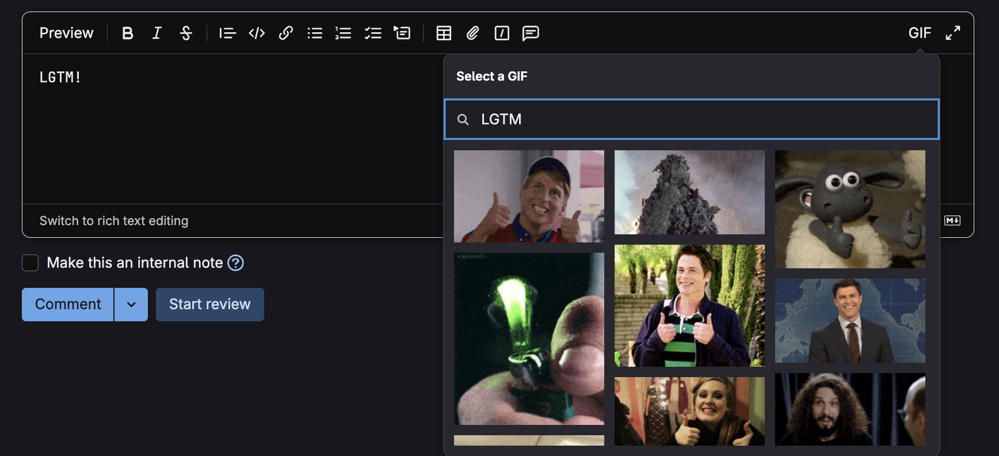

#  GIFs for GitLab

A Browser extension that makes it easy to search GIPHY and add a GIF into any GitLab comment box.

Special thanks to N1ck for making [gifs-for-github](https://github.com/N1ck/gifs-for-github), we take its project with small changes to function for GitLab.



## Contributing

After cloning it, use pnpm as package manager

```sh
pnpm install
```

```sh
pnpm run watch # Listen to file changes and automatically rebuild
```

### Debug Mode

When developing, you can enable debug mode by setting the DEBUG environment variable:

```bash
DEBUG=true npm run build
```

This will output helpful logs prefixed with 🎨 when using the extension.

Once built, load it in the browser of your choice with [web-ext](https://github.com/mozilla/web-ext):

```sh
npx web-ext run --target=chromium # Open extension in Chrome
```

```sh
npx web-ext run # Open extension in Firefox
```

Or you can [load it manually in Chrome](https://www.smashingmagazine.com/2017/04/browser-extension-edge-chrome-firefox-opera-brave-vivaldi/#google-chrome-opera-vivaldi) or [Firefox](https://www.smashingmagazine.com/2017/04/browser-extension-edge-chrome-firefox-opera-brave-vivaldi/#mozilla-firefox).
